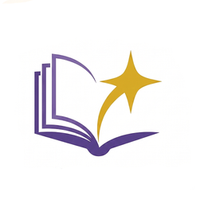
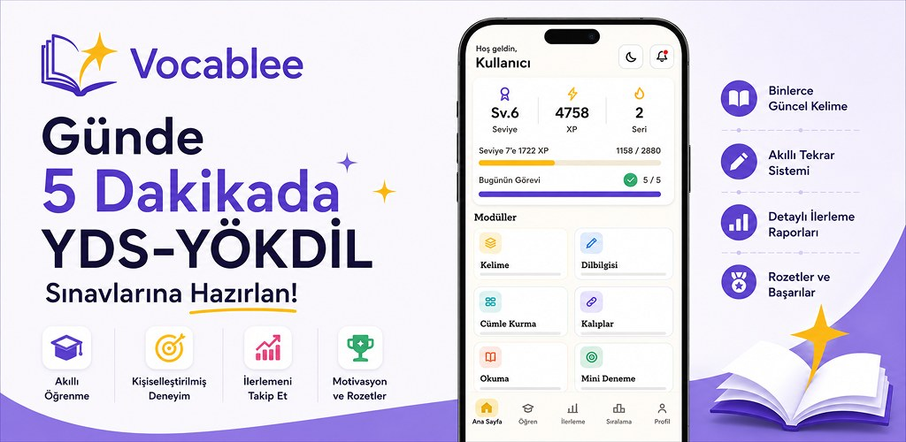
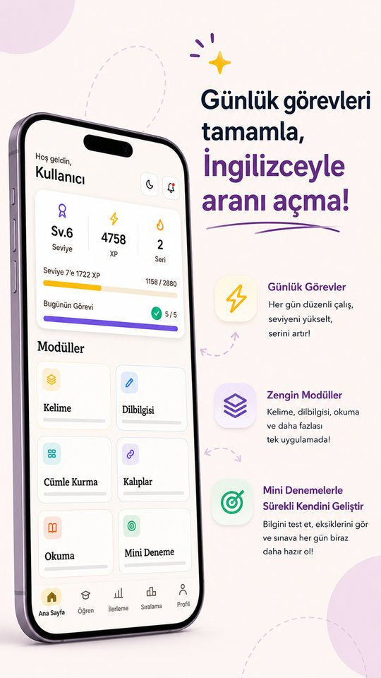
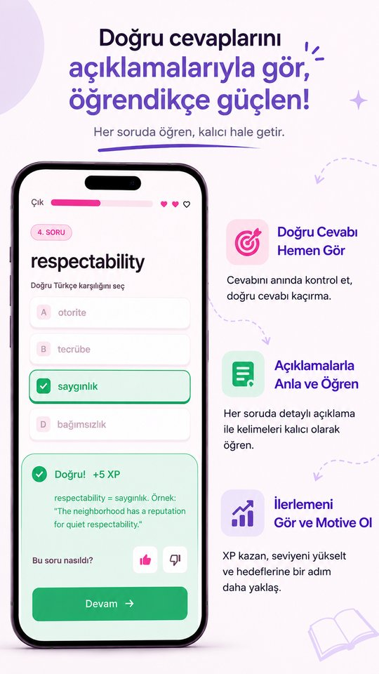
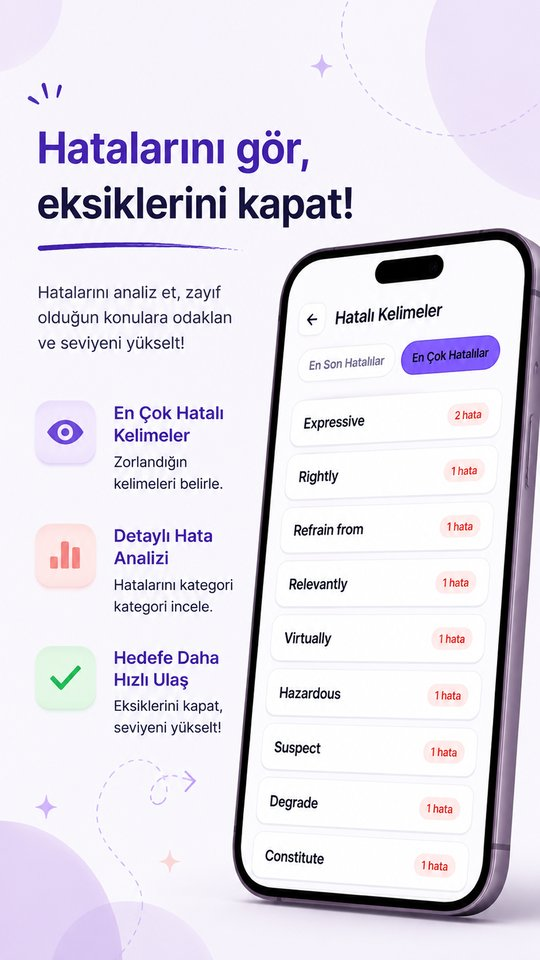
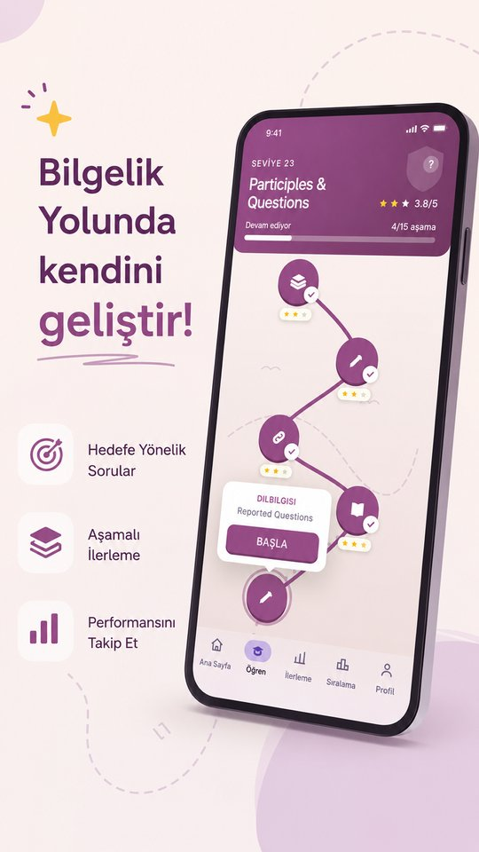
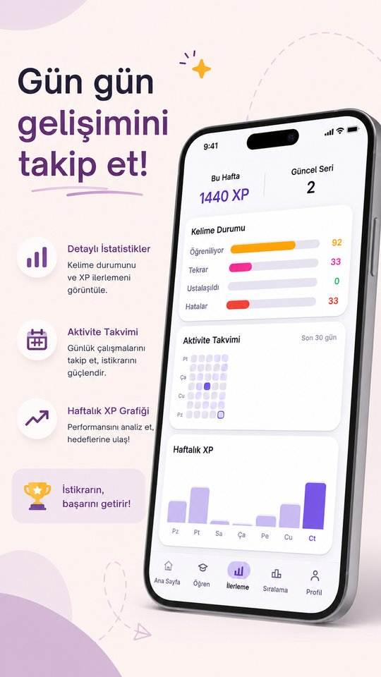
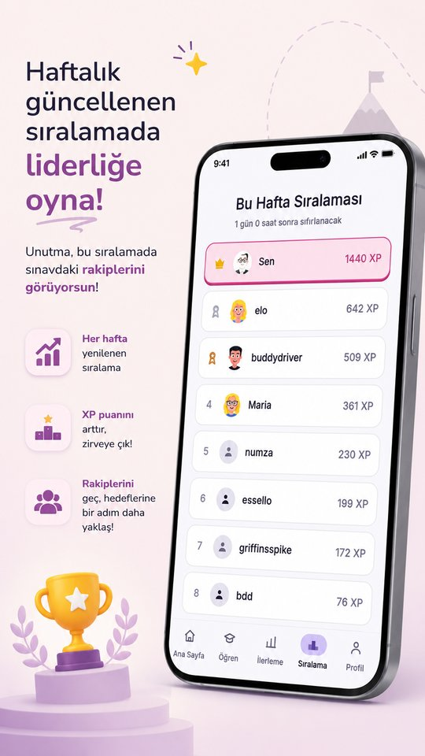
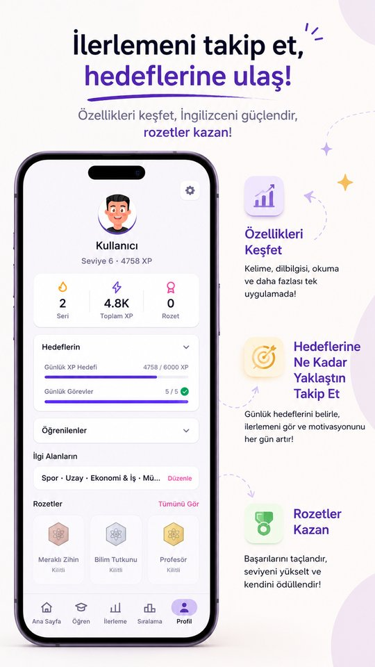

<div align="center">



# Vocablee

**Bite-sized, AI-powered exam prep for Turkey's YDS & YÖKDİL English proficiency exams**

[**Vocablee: YDS-YÖKDİL Kelimeler**](https://play.google.com/store/apps/details?id=com.erdag.ydsapp) — available on Google Play




</div>

---

## Why I built it

While preparing for YDS myself, I kept running into the same kind of app over and over: long word lists and flashcards that drifted away from what the exam actually asks. I wanted something that felt like the real exam, fit into five-minute breaks, and kept me coming back every day. I couldn't find it, so I built it.

## What it is

Vocablee is a free, ad-free, Duolingo-style micro-learning app for **YDS** and **YÖKDİL** candidates: university students, academics and graduate applicants in Turkey. A session takes about five minutes and each screen asks you to do one thing.

- **Vocabulary**: the words that come up most in YDS/YÖKDİL, scheduled with **SM-2 spaced repetition** so the words you struggle with come back before you forget them.
- **Grammar**: 81 topics from A1 to C2, each with a short rule card followed by exam-style questions.
- **Reading**: short passages with comprehension, inference and vocabulary-in-context questions.
- **Phrasal verbs & sentence building**: practice with set phrases, plus tap-to-order sentence building.
- **Mini mock exams**: short mixed tests that give an estimated YDS score and point out weak areas.
- **Adaptive placement test**: finds your CEFR level (A1–C2) in at most 20 questions and picks your starting point.

## AI-generated, exam-focused content

**All of the questions are original.** None are copied from past papers or other apps. They were written with AI, aimed squarely at the YDS/YÖKDİL format, and then put through a quality pipeline:

| Stage | What happens |
|---|---|
| **Exam-aligned generation** | AI produces questions in the same formats YDS/YÖKDİL use (word meaning, cloze grammar, phrasal verbs, reading comprehension, sentence completion). Each question is tagged with a CEFR level and a grammar topic. |
| **Smart distractors** | Wrong options share the correct answer's part of speech, level and (where possible) semantic field, and are never synonyms of it. Each option has to be plausible without being a second correct answer. |
| **Automated quality audits** | Scripts scan the whole bank for questions with more than one defensible answer, duplicate options, punctuation that gives the answer away, answers leaking into the question stem, and broken or missing explanations. |
| **Balancing** | The position of the correct answer is balanced within each level, and the share of Turkish-meaning vs. in-context questions is tuned so difficulty fits the learner's level. |
| **Explanations** | Every answer comes with an explanation, an example sentence and synonyms, so a wrong answer still teaches something. |
| **Feedback loop** | Learners can like or dislike individual questions, which helps flag questions for revision. |

### Content at a glance

| | |
|---|---|
| Learn Path | **50 levels**, A1 → C2, 575+ drills |
| Original questions | **5,000+** |
| Vocabulary | **1,400+** high-frequency exam words |
| Phrasal verbs | **230+** |
| Grammar | **81 topics**, 2,200+ questions |
| Reading | 500+ questions |
| Sentence building | 1,900+ items |
| Mini mock exams | 500 questions in fixed, difficulty-balanced sets |

## Screenshots

<div align="center">










</div>

## Built to build a habit

- **Daily streak** with a weekly streak shield and streak restore
- **XP and levels**, with level-up celebrations
- **Weekly leaderboard** that resets every Monday
- **Badges** and daily goal rewards
- **Mistake review**: your most-missed words, with error analysis by category
- **Offline-first**: lessons work without a connection, and progress syncs when you're back online
- **Smart reminders** through push notifications (at most 2 a day, with a grace period for new users)

## Architecture

```
┌──────────────────────────┐        ┌──────────────────────────┐
│  Flutter app (Android)   │  HTTPS │  FastAPI backend         │
│  Riverpod · go_router    │ ─────▶ │  Python 3.12 · async     │
│  Drift (SQLite, offline) │        │  SQLAlchemy 2.x          │
│  Offline sync queue      │        │  Serverless on Vercel    │
└────────────┬─────────────┘        └────────────┬─────────────┘
             │                                   │
             ▼                                   ▼
┌──────────────────────────┐        ┌──────────────────────────┐
│  Firebase                │        │  Supabase                │
│  FCM · Analytics ·       │        │  PostgreSQL + RLS · Auth │
│  Crashlytics             │        │  Storage · Realtime      │
└──────────────────────────┘        └──────────────────────────┘
                                    + Upstash Redis (cache)
```

| Layer | Technologies |
|---|---|
| **Mobile** | Flutter 3, Dart, Riverpod, go_router, Dio, Drift (SQLite) |
| **Backend** | Python 3.12, FastAPI, SQLAlchemy 2.x (async), Alembic, Pydantic |
| **Data** | Supabase PostgreSQL with Row-Level Security, Supabase Auth (email, Google) |
| **Infra** | Vercel serverless functions, Vercel Cron, Upstash Redis |
| **Engagement** | Firebase Cloud Messaging, Firebase Analytics, Crashlytics |
| **Learning engine** | SM-2 spaced repetition, adaptive (staircase) CEFR placement test |
| **Quality** | pytest suite with a coverage gate, GitHub Actions CI for backend and Flutter |

## Source code

This repository is a **project showcase**. Vocablee is a commercial product, so its source code, question bank and content pipeline are kept in a private repository and are **not open source**. If you'd like to talk about the project, feel free to reach out through GitHub.

---

<div align="center">

**[Vocablee: YDS-YÖKDİL Kelimeler](https://play.google.com/store/apps/details?id=com.erdag.ydsapp)**

© 2026 Vocablee. All rights reserved.

</div>
